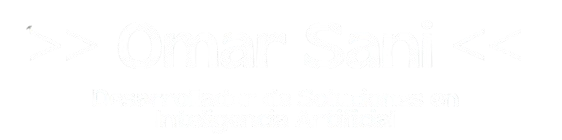

 

<h2> / Sobre Mi /</h2>
  
- ⭐ Soy desarrollador de software desde el 2023. 
- Mi trabajo consiste en diseñar software y sistemas para automatizar tareas repetitivas en procesos empresariales, desarrollar plataformas o aplicaciones que facilitan el acceso de comunidades a productos o servicios, y mejora la atención a miles de personas mediante un enfoque en la experiencia del usuario y la escalabilidad, investigando necesidades reales a través de metodologías de estudio de campo como levantamiento de requerimientos, analisis de datos o estudios de problematicas.
- Entre mis proyectos se destacan:

- **Sistema de vigilancia en Tiempo Real Alcon** (Comando conjunto de las Fuerzas Armadas)
- **Asistente virtual con Insteligenci Artificial** Martita IA (Gobierno de Cayambe Ecuador)
- **Empleatec** (Bolsa de empleo para el Instituto Nelson Torres) 
- **SPGCT** (Sistema para automatizacion de Veeduirar para certificacion de productores agroecologicos Cayambe-Ecuador)
- **Alarma Smart Ecu-911** (Gobierno de Cayambe Ecuador)
  
<h2> / HABILIDADES / </h2>

#### Version Control & DevOps

#### Frontend

#### Backend

#### Databases

#### APIs

    
  
  

> [!NOTE]
> Para una nota especial

> [!TIP]
> Para un consejo

> [!IMPORTANT]
> Para una nota importante

> [!WARNING]
> Para tener cuidado

> [!CAUTION]
> Esto es peligroso

------
Credit: [By Omar Sani](https://github.com/sonick-s)

Last Edited on: 14/12/2025
